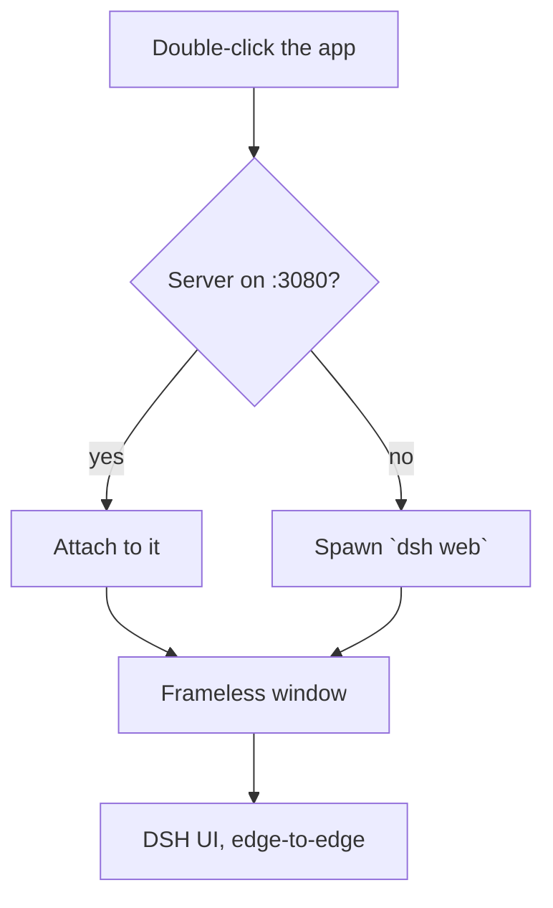

# DeepSeek Harness Desktop

**A clean, frameless desktop shell that turns your local [DeepSeek Harness](https://github.com/deepseek-ai/deepseek-harness) (`dsh`) into a real desktop app — no browser, no terminal, no clutter.**

[](LICENSE)

[English](README.md) · [中文](README.zh-CN.md)

---

## What is this?

`dsh-desktop` is a thin Electron shell around the official DeepSeek Harness web UI. It starts (or attaches to) your own local `dsh web` server and shows it in a **borderless native window**, so working with DSH feels like opening an IDE — not a browser tab.

It is **not** a fork, a reimplementation, or a "modified" DSH. It is a window around the exact `dsh` you already run. Your account, API keys, sessions, and settings never pass through this shell — they stay inside your own DSH.

## Why this exists — the pain points

| Pain | Without this | With this |
| --- | --- | --- |
| Starting DSH means typing `dsh web` in a terminal | open a console, run a command, keep it open | double-click the app |
| The browser adds tabs, address bar, and chrome | you get a webpage | you get a window |
| A browser tab doesn't feel like a real tool | Alt-Tab into "browser" | Alt-Tab into "DeepSeek Harness" |
| The web UI isn't a standalone app | pinned tabs, mixed with other sites | a real app window with its own controls |
| Sketchy "desktop" installers floating around GitHub | risk of malware / key theft | a minimal, auditable, open-source shell |

## Features

- **Frameless & immersive** — no title bar, no browser chrome; DSH fills the whole window edge-to-edge.
- **Custom window controls** — minimize / maximize / close are drawn to match the UI (transparent until hover; close turns red on hover), not a mismatched system bar.
- **Drag from the top** — an invisible drag strip lets you move the window like a normal title bar.
- **Single instance** — launching again focuses the existing window instead of spawning duplicates.
- **Smart server lifecycle** — attaches to a running `dsh web` server; if none is up, it spawns one and cleans it up on quit.
- **Theme built in** — DSH's own Light / Dark / System (Settings → General → Appearance). No theme plugin needed.
- **Zero-dependency fallback** — on Windows, `DSH Desktop.cmd` opens DSH in a chromeless Edge/Chrome `--app` window without installing anything.
- **Open source (MIT)** — tiny, readable, auditable.

## How it works



- `main.js` — Electron main process: single-instance lock, server lifecycle, window.
- `lib/dsh-server.js` — attach / spawn / wait / kill logic (plain Node, shared with the fallback launcher).
- `preload.js` — injects the invisible drag strip and the theme-matched window controls.

## Prerequisites

- [Node.js](https://nodejs.org) — for `npm` and for running `dsh`
- The `dsh` CLI on your `PATH`. If you don't have it:
  ```bash
  npm install -g @deepseek-ai/dsh
  ```

> The built exe is a **shell only** — it still needs `dsh` (and therefore Node.js) installed on the machine. It does not bundle a private copy of DSH.

## Run

```bash
git clone https://github.com/ljzwin/dsh-desktop.git
cd dsh-desktop
npm install
npm start
```

## Build a portable .exe (Windows)

```bash
npm run dist
# -> dist/DSH-Desktop-0.1.0.exe  (single-file, portable)
# -> dist/win-unpacked/          (unpacked directory)
```

> On Windows the build disables code signing (`signAndEditExecutable: false`) because the
> signing toolchain's `winCodeSign` archive contains macOS symlinks that fail to extract
> without Administrator / Developer Mode. The result is an unsigned exe — fine for personal use.

### Slow / stalled downloads (mainland China & proxied networks)

Electron and its toolchain download from GitHub, which can stall. Point them at mirrors:

```powershell
# PowerShell — set before `npm install` AND before `npm run dist`
$env:ELECTRON_MIRROR = "https://npmmirror.com/mirrors/electron/"
$env:ELECTRON_BUILDER_BINARIES_MIRROR = "https://npmmirror.com/mirrors/electron-builder-binaries/"
$env:NODE_OPTIONS = "--use-system-ca"   # if you hit "unable to verify the first certificate"
```

## Configuration

| Environment variable | Purpose | Default |
| --- | --- | --- |
| `DSH_DESKTOP_PORT` | Port to attach to / spawn on | `3080` |
| `DSH_DESKTOP_BIN` | Explicit `dsh` entry (a command, or a path to `bin.js`) | `dsh` |

## Theme

Theme is built into DSH, not this shell: **Settings → General → Appearance → Light / Dark / System**. The choice persists in your DSH settings.

## Plugins

Plugins keep going through the official DSH CLI:

```bash
dsh plugin --profile web add <package>
```

## The zero-dependency fallback (Windows)

No Electron needed — just double-click `DSH Desktop.cmd`. It starts DSH (or attaches to it) and opens it in a chromeless Edge/Chrome `--app` window. `Stop DSH.cmd` stops a server the launcher spawned.

> The `.cmd` launcher can't remove the native title bar — that's exactly why the Electron build exists.

## Troubleshooting

### `dsh` is not recognized
Install it globally (`npm install -g @deepseek-ai/dsh`), or set `DSH_DESKTOP_BIN` to the path of your `dsh` `bin.js`.

### Electron download stalls
Set `ELECTRON_MIRROR` (see above).

### "unable to verify the first certificate"
Your proxy re-signs TLS. Set `NODE_OPTIONS=--use-system-ca` (Node ≥ 22.9) before installing/building.

### The window has no title bar — how do I move it?
Drag the top edge (an invisible drag strip is there).

## Platform notes

Built and tested on Windows 10/11. The Electron app should also run on macOS/Linux, but the custom window-control glyphs use the Windows `Segoe MDL2 Assets` font, and the `.cmd` launchers are Windows-only — those parts would need porting.

## License

[MIT](LICENSE) © 2026 Peachfor
