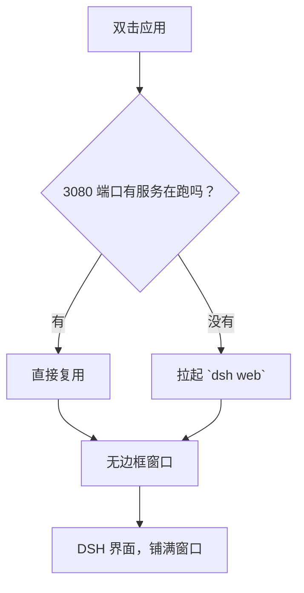

# DeepSeek Harness Desktop

**一个干净、无边框的桌面壳：把你本机的 [DeepSeek Harness](https://github.com/deepseek-ai/deepseek-harness)（`dsh`）装进真正的桌面应用——不用浏览器、不用敲命令、没有多余的界面。**

[](LICENSE)

[English](README.md) · [中文](README.zh-CN.md)

---

## 这是什么？

`dsh-desktop` 是官方 DeepSeek Harness 网页 UI 外面的一层**轻薄 Electron 壳**。它启动（或直接复用）你本机已有的 `dsh web` 服务，并把它显示在一个**无边框原生窗口**里，让使用 DSH 的体验像打开 IDE，而不是开一个浏览器标签页。

它**不是** DSH 的分支、重写，也不是什么"魔改版"。它只是给你已经在跑的那个 `dsh` 加了一扇窗。你的账号、API Key、会话、设置**都不会经过这个壳**——它们始终留在你自己的 DSH 里。

## 它解决了什么痛点？

| 痛点 | 之前 | 用了它 |
| --- | --- | --- |
| 启动 DSH 要在终端敲 `dsh web` | 开终端、跑命令、还不敢关 | 双击应用即可 |
| 浏览器自带标签页、地址栏、各种框 | 得到的是一个"网页" | 得到的是一个"窗口" |
| 浏览器标签页没有"真工具"的感觉 | Alt-Tab 切到"浏览器" | Alt-Tab 切到"DeepSeek Harness" |
| 网页 UI 不像独立软件 | 和其它网页混在一起 | 独立应用窗口，带自己的控制按钮 |
| GitHub 上各种来路不明的"桌面版" | 有中毒 / 偷 key 的风险 | 极简、可审计、开源的壳 |

## 特性 / 优势

- **无边框、沉浸式**——没有标题栏、没有浏览器框，DSH 界面铺满整个窗口。
- **自绘窗口按钮**——最小化 / 最大化 / 关闭三个按钮贴合界面风格（平时透明、悬停高亮、关闭悬停变红），不是那条格格不入的系统标题栏。
- **顶部可拖拽**——窗口顶部有一条透明拖拽区，像普通标题栏一样拖动窗口。
- **单实例**——重复打开只会聚焦已有窗口，不会弹出一堆副本。
- **聪明的服务生命周期**——已有一个 `dsh web` 在跑就直接复用；没有就帮你拉起来，退出时自动回收。
- **主题内置**——DSH 自带的浅色 / 深色 / 跟随系统（设置 → 通用 → 外观），无需装主题插件。
- **零依赖备用方案**——Windows 上双击 `DSH Desktop.cmd`，用 Edge/Chrome 的 `--app` 模式开一个无地址栏窗口，啥都不用装。
- **开源（MIT）**——代码量小、可读、可审计。

## 工作原理



- `main.js` — Electron 主进程：单实例锁、服务生命周期、窗口。
- `lib/dsh-server.js` — 复用 / 拉起 / 等待 / 回收的逻辑（纯 Node，与备用启动器共用）。
- `preload.js` — 注入透明拖拽区和贴合主题的窗口按钮。

## 环境要求

- [Node.js](https://nodejs.org) —— `npm` 和运行 `dsh` 都需要
- `dsh` 命令已在 `PATH` 中。如果没有：
  ```bash
  npm install -g @deepseek-ai/dsh
  ```

> 打包出来的 exe **只是壳**——它仍然需要机器上装了 `dsh`（也就是需要 Node.js）。它不会内置一份私有 DSH。

## 运行

```bash
git clone https://github.com/ljzwin/dsh-desktop.git
cd dsh-desktop
npm install
npm start
```

## 打包成便携版 exe（Windows）

```bash
npm run dist
# -> dist/DSH-Desktop-0.1.0.exe  （单文件便携版）
# -> dist/win-unpacked/          （解包目录）
```

> Windows 上打包时关掉了代码签名（`signAndEditExecutable: false`），因为签名工具链里的
> `winCodeSign` 压缩包内含 macOS 符号链接，在没有管理员权限 / 开发者模式时会解压失败。
> 结果是未签名的 exe，个人使用完全没问题。

### 下载慢 / 卡住（国内网络 & 代理环境）

Electron 及其工具链从 GitHub 下载，容易卡住。可以换成镜像：

```powershell
# PowerShell —— 在 `npm install` 之前、以及 `npm run dist` 之前都要设置
$env:ELECTRON_MIRROR = "https://npmmirror.com/mirrors/electron/"
$env:ELECTRON_BUILDER_BINARIES_MIRROR = "https://npmmirror.com/mirrors/electron-builder-binaries/"
$env:NODE_OPTIONS = "--use-system-ca"   # 如果报 "unable to verify the first certificate"
```

## 配置

| 环境变量 | 作用 | 默认值 |
| --- | --- | --- |
| `DSH_DESKTOP_PORT` | 复用 / 启动的端口 | `3080` |
| `DSH_DESKTOP_BIN` | 显式指定 `dsh` 入口（命令，或 `bin.js` 的路径） | `dsh` |

## 主题

主题是 DSH 内置的，不是这个壳提供的：**设置 → 通用 → 外观 → 浅色 / 深色 / 跟随系统**。选择会持久化到你的 DSH 设置里。

## 插件

插件仍走官方 DSH CLI：

```bash
dsh plugin --profile web add <包名>
```

## 零依赖备用方案（Windows）

不用装 Electron——直接双击 `DSH Desktop.cmd`。它会拉起 DSH（或复用已有服务），并用 Edge/Chrome 的 `--app` 模式开一个无地址栏窗口。`Stop DSH.cmd` 用来停掉启动器拉起的服务。

> `.cmd` 启动器没法去掉系统标题栏——这正是 Electron 版存在的原因。

## 常见问题

### 提示 `dsh` 不是可识别的命令
全局安装一下（`npm install -g @deepseek-ai/dsh`），或者把 `DSH_DESKTOP_BIN` 指向你 `dsh` 的 `bin.js` 路径。

### Electron 下载卡住
设置 `ELECTRON_MIRROR`（见上文）。

### 报 "unable to verify the first certificate"
你的代理在重签 TLS。安装 / 打包前设置 `NODE_OPTIONS=--use-system-ca`（Node ≥ 22.9）。

### 窗口没有标题栏，怎么拖动？
拖动窗口顶部边缘（那里有一条透明的拖拽区）。

## 平台说明

在 Windows 10/11 上开发并测试。Electron 应用理论上也能跑 macOS / Linux，但自绘窗口按钮用的是 Windows 的 `Segoe MDL2 Assets` 字体、`.cmd` 启动器也是 Windows 专属——这些部分需要适配。

## License

[MIT](LICENSE) © 2026 Peachfor
